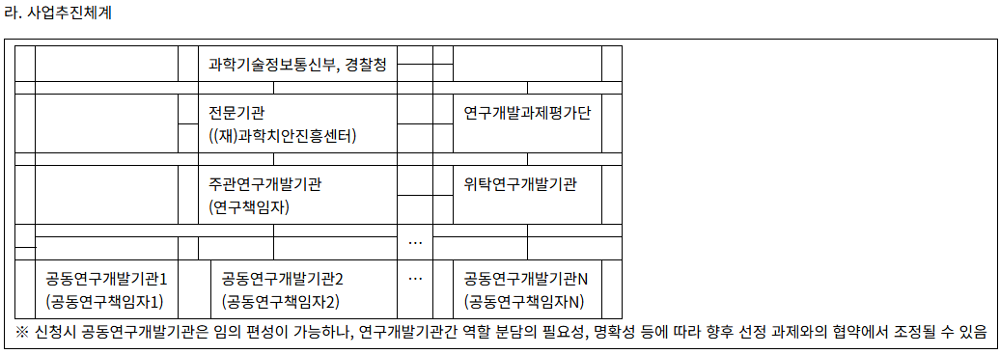
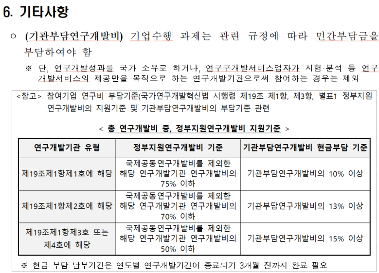
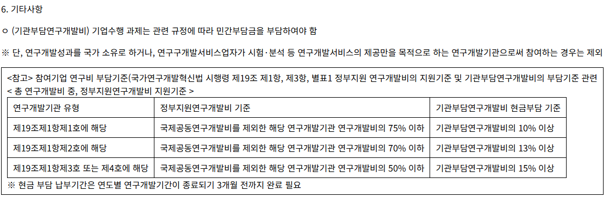

# HwpxConverter

## 이 프로젝트는 무엇인가요?

`HwpxConverter`는 **HWPX(OWPML) 문서를 파싱해 HTML로 변환**하는 Windows용 변환기입니다.
한컴에서 공개한 **OWPML SDK(라이브러리)** 를 사용해 문서 구조(섹션/문단/런/표 등)를 순회하며, 정보를 인식하기 좋은 형태로 HTML을 생성합니다.

이 프로젝트는 다음 용도로 쓰기 좋습니다.

* HWPX → HTML 변환(1차 목표)
* RAG/검색 파이프라인용 전처리(HTML/텍스트 추출 기반)
* 공공기관 문서(표/개요/리스트 등) 일괄 변환 테스트

---

## 주요 기능

* 문서 텍스트 추출(Paragraph/TextRun 기반)
* outline(개요 1-10) → h1-h6 등 태그 매핑
* 표(table) 레이아웃 및 텍스트 렌더링
* 리스트 렌더링(정책: **번호 계산 없이**, `<ol>` 유지 + 화면은 점만 보이게)


<p align="center">
    
</p>

출처 : 경찰청 공식 발간자료 (2026년도 미래치안도전기술개발사업 신규과제 선정계획 공고)

---

## 지원/제한 사항

* 입력: `.hwpx`만 지원합니다.
* `.hwpx` 확장자여도 **표준 HWPX가 아니거나 손상된 파일**은 열리지 않을 수 있습니다.
  (예: 구버전 HWP를 확장자만 바꾼 경우, 일부 기관 문서의 비표준/손상 케이스 등)
* 현재는 Windows + Visual Studio 2022 환경을 기준으로 합니다.

---

## 1) 바로 사용하기 (GitHub Releases)

소스 빌드 없이 실행 파일로 사용하려면 GitHub의 **Releases**에서 최신 버전의 실행 파일(`HwpxConverter.exe`)을 내려받아 실행하세요.

예시:

```bash
HwpxConverter.exe "input.hwpx" "output.html"
```

* 경로/파일명에 공백이 있으면 따옴표로 감싸는 것을 권장합니다.

---

## 2) Windows에서 빌드하기 (Visual Studio)

이 프로젝트는 한컴 OWPML SDK 라이브러리가 필요합니다.

### 빌드 환경

* Windows 11
* Visual Studio 2022
* 플랫폼: Win32(x86) (현재 프로젝트 설정 기준)

### 준비물: 한컴 OWPML SDK 라이브러리

한컴 공개 레포에서 OWPML SDK를 준비합니다.

* 참고: [https://github.com/hancom-io/hwpx-owpml-model](https://github.com/hancom-io/hwpx-owpml-model)

해당 레포를 빌드하여 생성되는 라이브러리(예: `Owpml.lib`, `OWPMLApi.lib`, `OWPMLUtil.lib`)와 include 파일들을
이 레포의 `include/`, `lib/` 구성에 맞게 배치합니다.
(프로젝트 설정에 따라 경로가 다를 수 있으니, `.vcxproj`의 Include/Library 경로 설정을 기준으로 맞춰주세요.)

### 빌드 방법

1. Visual Studio에서 솔루션(`HwpxConverter.sln`) 열기
2. 구성(Configuration): `Release`
3. 플랫폼(Platform): `Win32`
4. 빌드(Build)

빌드가 완료되면 `Release/`에 `HwpxConverter.exe`가 생성됩니다.

---

## 실행 방법

### 커맨드라인

```bash
HwpxConverter.exe "InputFile.hwpx" "OutputFile.html"
```

* 입력 파일이 `.hwpx`가 아니면 즉시 에러를 출력하고 종료합니다.
* `.hwpx`인데도 변환 실패 시 “표준 HWPX가 아니거나 손상” 가능성을 안내합니다.

---

## 테스트

로컬 테스트 케이스를 아래처럼 관리하는 것을 권장합니다.

* `test/cases/` : 입력 hwpx 파일
* `test/expected/` : 기대 결과(html) 또는 기준 출력
* `test/out/` : 실제 실행 결과(생성물, gitignore 권장)

예시:

```bash
HwpxConverter.exe "test/cases/table_only.hwpx" "test/out/table_only.html"
```

추천 테스트 구성(최소 3종):

* 개요(outline)만 있는 문서
* 표(table)만 있는 문서
* 리스트(list)만 있는 문서


---
## 기여 가이드(간단)

* 들여쓰기: 스페이스
* 인코딩: UTF-8 권장
* 커밋 메시지 예시: `converter: add hwpx extension validation`

---

## 라이선스

자세한 내용은 `LICENSE`를 참고하세요.

---

## 참고

* Hancom OWPML SDK / Reference implementation: [https://github.com/hancom-io/hwpx-owpml-model](https://github.com/hancom-io/hwpx-owpml-model)

---
## 예시
<p align="center">
    
</p>
<p align="center">
    
</p>
<p align="center">
    
</p>

<p align="center">
    
</p>
